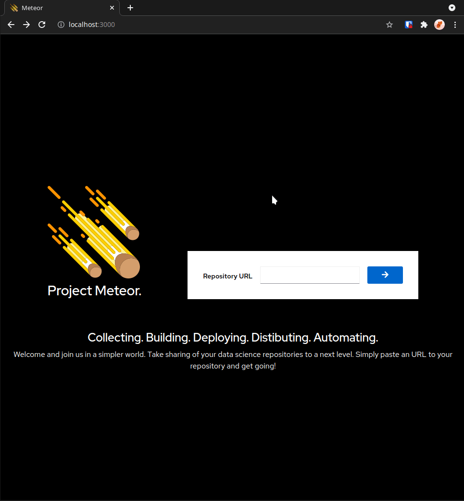

**⚠️ Deprecated. Replaced with https://github.com/AICoE/meteor**

# Meteor command center



## Devel setup

### Prepare environment

Frontend:

```sh
cd frontend
npm install
```

Backend:

```sh
cd backend
go mod download
```

### Start

In developer setup it is advised to start both frontend and backend instances in dev mode in separate terminals.

Start frontend deployment with hot reloading and API forwarding to dev backend:

```sh
make dev-frontend
```

Start backend to serve API:

```sh
make dev-backend
```
